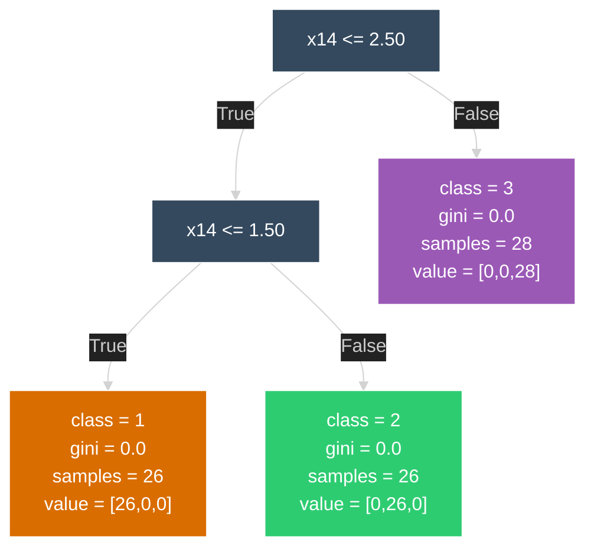

<br>
 
 
 \[[🇧🇷 Português](README.pt_BR.md)\] \[**[🇺🇸 English](README.md)**\]


<br>

# <p align="center">  Social [Buzz AI]()

<br><br>


<p align="center">
   
 </p>

<br><br>

[**Course:**]() Humanistic AI & Data Science (4th Semester)  
[**Institution:**]() PUC-SP  
**Professor:** [Erick Bacconi](https://www.linkedin.com/in/eric-bacconi-423137/)  


<br><br>


#### <p align="center"> [](https://github.com/sponsors/Mindful-AI-Assistants)


<!--Confidentiality Statement-->

<br><br>

> [!TIP]
>
> * [Extension_Project - Exploratory](https://github.com/Mindful-AI-Assistants/1-social-buzz-ai-main/tree/85e2162c85453571eec2db30eeb3342ee16dd39d/%E2%9A%A0%EF%B8%8F%20Extension_Project_Coord_Prof_Erick/dataset)
>
> 
> This main project 1-social-buzz-ai-main includes several specialized sub-repositories that contribute to its overall framework and analyses. Some of the key > > participant repositories are:
> 
> * [2-social-buzz-ai-GBoost-and-LowDefault-Modeling]() – Focused on Gradient Boosting and Low Default modeling strategies.
> 
> * [3-social-buzz-ai-Support-Vector-Machines-SVM]() – Dedicated to Natural Language Processing insights and social media data analysis.
> 
> Each repository contributes unique datasets, modeling approaches, and analyses, making the main repository a comprehensive resource for exploring social buzz, > predictive modeling, and AI-driven insights.
> 
> <br>


<br><br>


> [!IMPORTANT]
>
> ⚠️ Heads Up 
>
> * Projects and deliverables may be made [publicly available]() whenever possible.
>
> * The course prioritizes [**hands-on practice**]() with real data in consulting scenarios.
>
> *  All activities comply with the [**academic and ethical guidelines of PUC-SP**]().
>
> * [**Confidential information**]() from this repository remains private in [private repositories]().
>
>

#  

<br><br><br>

<!--End-->


> [!TIP]
>
>  Extras Links We Use:
>
> - [Qlik](https://www.qlik.com/us)
>
> -  [MNTN - Marketing Metrics & KPIs to Measure Performance](https://mountain.com/blog/marketing-metrics/)
>  - [What is AIference ?](https://www.cloudflare.com/learning/ai/inference-vs-training/)
>  
>  - [Bossa Invest Strategic Planning](https://bossainvest.com)
>  
>  - [Venturus - MindfulaAI](https://venturusai.com/business/1TwGzr-mindfulai/report/finances)
>  
>  - [Thje-state-of-crm-data-management-in-202522-2025](https://github.com/Mindful-AI-Assistants/Project-Startup-Mindful-Emotional-AI-Scalable-Ethical-InferenceOps/tree/bccd942f5a89eb511645ea073115c24b53e3a28d/Thje-state-of-crm-data-management-in-202522-2025)
> 
>  - 🇪🇺 [EU AI ACT - Emotional Prohibited AI Practices](https://bluearrow.ai/emotion-recognition/)
>
>  - 🇪🇺 [European Comission Site Regulations Documents](https://commission.europa.eu/document/f5aee532-70bf-41b1-a94a-8e294a528f6a_en)
>
>  - 🇪🇺 [Brazil's Adequacy under the GDPR: Level of Personal Data Protection according to Regulation (EU) 2016/679 - 2025/10](https://github.com/Mindful-AI-Assistants/Project-Startup-Mindful-Emotional-AI-Scalable-Ethical-InferenceOps/tree/e5b33473b87a3da63fd4a5206340fca21b52c01c/The-state-of-crm-data-management-in-202522-2025)
>
> 
> 
>
> 


<br><br>


## Social Buzz AI -  [What’s This ?]()

Welcome to [**Social Buzz AI**]() our MVP for cracking the code on social media trends and delivering laser-focused marketing hacks powered by data and AI. Built for the [Social Networks]() and [Marketing]() course at PUC-SP, this repo is the playground where we [prototype](), [test](), and evolve smart tools to help brands dominate digital spaces through real data-driven insights.


<br><br>

## Table of Contents

- [What’s This?](#whats-this)  
- [Why It Matters](#why-it-matters)
- I - [Data-Driven Culture and CRM Data Quality](https://github.com/Mindful-AI-Assistants/social-buzz-ai/tree/7e4a728795bd44618d7e8f266dfbe0178fbb848d/class_1-%20Data%20Driven%20Culture) 
- II - [Marketing 4.0](https://github.com/Mindful-AI-Assistants/social-buzz-ai/tree/7e4a728795bd44618d7e8f266dfbe0178fbb848d/class_1-%20Data%20Driven%20Culture) - Philip Kotler
- [Project Objectives](#project-objectives)  
- [What We’re Building](#what-were-building)  
- [Repo Breakdown](#repo-breakdown)  
- [Tech Stack & Tools](#tech-stack--tools)  
- [Metrics & KPIs We Track](#metrics--kpis-we-track)  
- [Getting Started — Move Fast, Start Simple](#getting-started--move-fast-start-simple)  
  - [Prerequisites](#prerequisites)  
  - [Installation](#installation)  
  - [Quick Run](#quick-run)  
  - [Environment Setup](#environment-setup)  
- [How to Use This Repo](#how-to-use-this-repo)  
- [Important Notes & Best Practices](#important-notes--best-practices)  
- [Scripts Overview](#scripts-overview)  
  - [`fetch_twitter_data.py`](#fetch_twitter_datapy)  
  - [`run_dashboard.py`](#run_dashboardpy)  
  - [`generate_reports.py`](#generate_reportspy)  
- [Team Hustlers](#team-hustlers)  
- [Contact & Support](#contact--support)  
- [Appendix: Example Social Media Report Template (Summary)](#appendix-example-social-media-report-template-summary)  


<br>

## [Why It Matters]()

Social networks shape consumer vibes daily. [Our mission ?]() Turn raw social data into actionable intel and hyper-targeted campaigns that scale fast, maximize reach, and boost [ROI]() (Return on Investment). By bridging social media analytics with AI, [we empower marketers]() with the intelligence to win attention, engagement, and conversions.


<br><br>

# I - [Data-Driven Culture and CRM Data Quality]()  


<br>

☞ [Access Support Material](https://github.com/Mindful-AI-Assistants/social-buzz-ai/tree/f9ed63b2a0508f647aeea3855e0889c0d0c07270/class_1)

<br>


### Embracing a [True]() Data-Driven Culture

<br>

🚫 [**What NOT to do**]()

- Executives decide first, then look for data to support their decisions.  
- Rely solely on instinct or gut feelings to make decisions.


<br><br>


✅ [**What TO do**]()

<br>


- Let data not only indicate *that* a decision is needed but also *which* decision is optimal, based on evidence.  
- Managers and leaders must take responsibility to moderate and validate decisions using what data reveals, rather than personal biases or unsupported opinions.


A true data-driven culture transforms how decisions are made: it places evidence at the center of all strategic and operational choices. This means [building trust in data](), fostering [transparency](), and [encouraging teams]() to adopt analytic [thinking] as a core [mindset]().

<br>


🌱 Leaders play a critical role by modeling data-informed behavior and demanding accountability grounded in facts. When done right, data guides innovation, risk management, and performance, freeing organizations from guesswork and enabling faster, smarter responses to change.


<br>

### [Common Pitfalls to Avoid]()

[-]() Post-hoc justification with data ("data fishing") to back a preconceived decision.  

[-]() Overconfidence in intuition ignoring analytical insights.  

[-]() Lack of data literacy and accessibility, which leads to misuse or mistrust of data.


<br>

### [Data Quality Challenges in CRM Systems]()

Quality of CRM data critically affects the insights used to drive marketing, sales, and customer support efforts.

According to the 2022 study [*"The State of CRM Data Quality"*]() by Validity (a leading provider of email marketing intelligence and CRM data management):

<br>

- [**76%**]() of respondents rated the quality of their CRM data as "good" or "very good". Yet, many still see poor data quality as a barrier limiting new sales opportunities.

- [**79%**]() agree that data deterioration has accelerated at an unprecedented pace, driven notably by pandemic-related disruptions.  

- [⚠️ **75%**]() admit [employees]() sometimes [fabricate data]() to tell the story [they want]() decision-makers to hear, rather than [reflect reality](). 🙂

- Meanwhile, [**82%**]() report pressure to find numbers supporting a specific narrative versus providing accurate, objective information.

<br>

These findings highlight a [paradox in CRM data management](): organizations recognize the importance of [data quality]() but [struggle]() with cultural and operational [challenges]() that [degrade trust]() and [utility]().


<br><br>


### [Key Takeaways for Social Buzz AI Project]()

[-]() Promote *data integrity* and discourage “storytelling” with selective or fabricated data.  

[-]() Foster transparent data governance and regular audits to ensure CRM data accuracy and completeness.  

[-]() Empower teams with tools and training to interpret CRM data critically, using it as a guide rather than a biased narrative.  

[-]() Integrate data quality metrics in your dashboards to continuously monitor and improve CRM data health.  

[-]() Align data-driven practices organization-wide—from executives to frontline users—to build a resilient, trustworthy foundation for marketing and AI initiatives.

<br>

### 🌱 By addressing [both]() the [behavioral shifts]() toward [authentic data-driven decision-making]() and acknowledging the persistent hurdles in [CRM data quality](), your project can help build [powerful, trustworthy]() tools that support smarter, evidence-based marketing strategies.


<br><br>


# II - [Marketing 4.0]()

<br>

☞ [Access Support Material](https://github.com/Mindful-AI-Assistants/social-buzz-ai/blob/7789bc13ed3133dadb0543e1c245cfe429fc5f3b/class_2%20-%20MKT%204.0%20-%20Philip%20Kotler/Marketin%20g%204.0%20-%20Philip%20Kotler.pdf)

<br>

> “Marketing is no longer about the products we sell, but about the connections we create.”
> — *Philip Kotler*

<br>


[**Marketing 4.0**]() is an approach that blends traditional marketing with digital innovations to engage consumers in a more participative, connected, and humanized way. Customers now actively contribute to building brand value instead of being passive recipients. As *Philip Kotler* explains, Marketing 4.0 focuses on authentic relationships and meaningful human connections, empowering marketers to use data and technology as tools, not just ends.

<br>

###  <p align="center"> [Key Themes]() 

<br>

| Topic | [Description]() |
| :-- | :-- |
| [**What is Marketing 4.0?**]() | Integration of offline and online marketing to create seamless, personalized, and connected customer journeys beyond mere product sales. |
| [**Importance of Marketing 4.0**]() | Addresses challenges/opportunities from digital transformation and changing consumer behaviors driven by connectivity and social media. |
| [**Integration of Online and Offline**]() | Consumers move fluidly between digital and physical worlds. Marketing 4.0 unifies these experiences for consistency and personalization. |
| [**Customer Empowerment and Inclusion**]() | Power shifts to consumers who share opinions publicly and co-create products and experiences, changing brand-consumer power dynamics. |
| [**Emotional Connection \& Authentic Communication**]() | Brands build trust through empathetic understanding, transparent messaging, and purposeful communication beyond selling products. |
| [**Personalization at Scale**]() | Utilization of data analytics and AI for effective segmentation and message tailoring to specific audience groups. |
| [**Focus on the Entire Customer Journey**]() | Every phase—awareness, purchase, post-sale—is an opportunity for personalized engagement and experience enhancement. |
| [**Social Media \& Digital Word-of-Mouth**]() | Influencers and peer reviews heavily impact consumer decisions, making social engagement indispensable. |
| [**Digital Transformation**]() | Necessitates building trust and authentic connections in a market where consumers have unprecedented control. |
| [**Evolution of Marketing Models**]() | From Marketing 1.0 (product-centric) to 4.0 (connectivity and experience), progressing toward 6.0 (sustainability and digital inclusion). |
| [**Data-Driven Marketing and the 5 V’s**]() | Volume, Velocity, Variety, Veracity, and Value guide effective collection and use of big data in marketing. |
| [**Challenges and Benefits of Data-Driven Marketing**]() | Enables precise targeting but requires privacy management, integration of data sources, and meaningful insight extraction. |
| [**Tools \& Techniques**]() | Google Analytics, Mixpanel, Power BI, automation, AI, and predictive analytics are widely used for optimization and personalization. |
| [**Strategic Digital Marketing Planning**]() | Aligns consumer behavior insights, technology, and channel management to maximize marketing effectiveness. |
| [**The 4 Cs of Marketing 4.0 (by Kotler)**]() | Customer (needs), Convenience (accessibility), Communication (engagement), Cost (perceived value rather than just price). |
| [**Mobile Marketing and User Experience**]() | Critical focus on responsive websites, intuitive apps, and optimized mobile content to enhance engagement. |
| [**Omnichannel and Real-Time Analysis**]() | Integration across channels with live data analytics enables dynamic campaign adaptation and personalization. |
| [**Case Studies**]() | Amazon’s AI-driven recommendations improve conversion rates; Netflix and Spotify utilize data analytics and AI to offer highly personalized user experiences. |


<br>


###  <p align="center"> [B2B and B2C]() in Marketing 4.0

<br>


| Business Model | [Key Focus \& Strategies]() |
| :-- | :-- |
| [**B2B (Business-to-Business)**]() | Leveraging digital tools and data analytics for account-based marketing, personalized buyer journeys, and building trusted partnerships with long sales cycles. |
| [**B2C (Business-to-Consumer)**]() | Leveraging social media, influencers, AI-powered personalization for emotional connections and seamless shopping experiences, focusing on convenience and immediacy. |

> *Both sectors benefit from Marketing 4.0’s data-driven personalization but differ in communication styles, content, and sales cycles.*

<br>

###  <p align="center"> Digital [Transformation]()

<br>
                                

| [Era]()              | [Marketing 1.0]()              | [Marketing 2.0]()              | [Marketing 3.0]()                | [Marketing 4.0]()            | [Marketing 5.0]()                 | [Marketing 6.0]()                                   |
| ---------------- | ------------------------- | ------------------------------ | ------------------------------- | ---------------------------- | ------------------------------------------- | ---------------------------------------------- |
| [Historical context]() | Industrial Revolution  | Information Age  | Globalization & Participation | Digital Transformation  | Technology & Artificial Intelligence | [Sustainability & Digital Inclusion]() |
| [Period]()           | Until 1970                | 1980 to 2000                   | 2000 to 2010                    | 2010 to 2020                 | From 2020 onwards                 | [Near Future]()     |
| [Focus]()            | Product-centric   | Consumer-centric           | Human-centric      | Connectivity & Experience    | Technology for well-being         | [Social and Environmental Impact]()          |
| [Differentiation]()  | Product         | Value for the client        | Values and purpose      | Personalization & Experience | Data-driven innovation           | [Sustainable & ethical solutions]()       |
| [Values]()        | Functionality        | Benefits & satisfaction       | Ethics, Sustainability & Culture| Inclusion & Interactivity    | Humanization of technology     | [Collective responsibility]()   |                
| [Collaboration]()    | Almost nonexiste | Client feedback       | Co-creation of value    | Real-time digital interaction| Partnerships with advanced technologies      | [Global collaborative ecosystems]() |
| [Objective]()    | Sell, sell, sell    | Satisfy and retain clients      | Make the world a better place   | Engage the client          | Create sustainable value     | [Transform the world positively]()  |
| [Consumer]() | Focused on basic needs    | More demanding                | More conscious            | More emotional & connected   | Protagonist of their journey      | [Engaged and socially active]()     |
| [Client interaction]() | One-to-many transactions | One-to-one relationsh    | Many-to-many collaboration      | Many-to-many digital collaboration | Immersive and personalized experience     | [Humanized and sustainable connections]()    |


<br>

### [Personas]()

**Personas** are detailed representations of the ideal customers for a product or service. They are built from real data (demographics, behaviors, motivations, pain points, etc.) to ensure the company deeply understands its target audience. By developing personas, a company can:

- Customize communications and value propositions for each customer profile.
- Make marketing more personal, relevant, and effective.
- Align the customer journey with expectations and needs.

<br>

## [Customer Journeys]()

The **Customer Journey** maps all points of contact and interactions a customer has with a brand before, during, and after a purchase.

- The journey includes stages from first awareness to post-sales, considering both online and offline touchpoints.
- Marketing 4.0 values and personalizes every stage, delivering consistent experiences across all channels.
- Example Stages: Awareness → Consideration → Purchase → Post-Purchase → Loyalty → Advocacy

<br>

### [Importance of Strategic Planning in Marketing 4.0]()


[**Strategic planning**]() is vital for achieving business objectives in the digital environment.

[**Benefits:**]()
- Ensures clear direction and alignment with business goals.
- Optimizes resources by focusing on the right channels and initiatives.
- Enables continuous monitoring and quick adaptation to results.

<br>

[**Components:**]()
- Market analysis: Consumer behavior, competition, trends.
- Objective definition: Clear, measurable goals.
- Strategy & Tactics: Integrating marketing, technology, and design.
- Technology Adoption: CRM, automation, data analytics.
- Metrics & Adjustments: Continuous improvement based on analytics.

<br>

### [Key Success Factors]()

To succeed with Marketing 4.0, consider:
- Evolving customer behavior
- Consistent presence across various digital channels
- Integration between marketing, technology, and design to enhance user experience
- Highly personalized and engaging campaigns
- Successful companies (example: Nubank) utilize digital convenience, transparency, and customer-driven strategies


<br>

## [The 4 Cs of Marketing 4.0 (Kotler)]()

Kotler's 4 Cs shift the focus from the classic 4 Ps to consumer-centricity:

<br>

| Traditional 4 Ps    | Modern 4 Cs (Kotler)             |
|---------------------|----------------------------------|
| Product             | Customer (Needs & Wants)         |
| Price               | Cost (To Satisfy the Customer)   |
| Place               | Convenience (Ease of Purchase)   |
| Promotion           | Communication (Two-way, Engaging)|


<br>

- [**Customer:**]() Deep understanding of consumer needs is at the center.
- [**Convenience:**]() Make products/services easily accessible and simple to acquire.
- [**Cost:**]() Address perceived value, not just price.
- [p**Communication:**]() Prioritize interactive, real, and transparent communication.


<br>

### [The Marketing 4.0 Plan]()

A well-built marketing plan details:

1. [**Market Analysis**]() – Researching consumer behavior and trends.
2. [**Goal Setting**]() – Defining clear, specific, and measurable objectives.
3. [**Strategy & Tactics**]() – Coordinating actions across digital and traditional channels.
4. [**Technology Implementation**]() – Using CRM, marketing automation, and analytics platforms.
5. [**Continuous Measurement**]() – Monitoring KPIs, ROI, and making rapid adjustments.

<br><br>

[**Types of Digital Presence:**]()

- [**Owned:**]() Channels controlled by the company (website, social media).
- [**Paid:**]() Acquired reach (ads, sponsored content).
- [**Earned:**]() Organic word-of-mouth (reviews, shares, SEO).

<br>

### [Reflection:]() Applying Marketing 4.0 to Improve Customer Experience

<br>

[**Key applications for companies:**]()

- Embrace new digital realities and build deeper customer relationships using data, technology, and personalization.
- Use personas and journey mapping to identify and address pain points.
- Personalize communication using data-driven insights and automation.
- Foster authentic engagement and create compelling experiences across all digital and offline touchpoints.
- Consistently measure and improve the customer experience to strengthen loyalty and brand advocacy.

<br><br>

[**Conclusion:**]() 
Strategic planning in Marketing 4.0 enables companies to adapt to a digital-first world, increase connection with customers, and remain competitive by delivering real value, personalization, and trust.

[For Reflection]()
Marketing 4.0 represents a shift from product-focused to customer-centric marketing. It emphasizes authentic, technology-enabled connections supported by data-driven insights. Successful adoption requires integrating traditional and digital strategies, harvesting actionable data, and continuously adapting to meet evolving customer expectations to build enduring brand loyalty.


<br><br>


# III - [Segmentation - RFV Code and Dataset]()

<br>

> [!TIP]
>
> [Accesst](https://github.com/Mindful-AI-Assistants/social-buzz-ai/blob/8f1e269838679dff388ce0e8679dd2b9dde4658e/class_3a-Code_RVF/Code/rfv.xlsx):  Datase
>
> [Access](https://github.com/Mindful-AI-Assistants/social-buzz-ai/blob/8f1e269838679dff388ce0e8679dd2b9dde4658e/class_3a-Code_RVF/Code/RFV_ressence_frequence_value.ipynb): Code
> 
> [Access](https://github.com/Mindful-AI-Assistants/social-buzz-ai/tree/8f1e269838679dff388ce0e8679dd2b9dde4658e/class_3a-Code_RVF/Code/Results%20Spread%20Sheet):  Excel Table Results 
> 


<br>

This guide summarizes and explains the essential concepts of market segmentation presented in the attached PDF, focusing on why segmentation matters, how to perform it, important metrics like CLV and RFV, and different segmentation models.

<br>

## [Why Segment ?]()

Segmentation allows companies to identify and prioritize the most attractive market segments and fortify their position within these segments.

- [**Customer Understanding:**]() By segmenting, companies better understand the needs and desires of different customer groups.

- [**Offer Personalization:**]() Enables more assertive offerings and more effective allocation of marketing efforts to the most profitable segments.

- [**Competitive Advantage:**]() Targeted efforts provide greater perceived value, increasing customer loyalty and referrals, which leads to greater market share and profits over time.

- [**Decreasing Marketing Effort:**]() As loyalty grows, less marketing effort is needed for the same or higher profitability.


<br>

> [!IMPORTANT]
>
> *"The company segments the market, chooses the best segments, and strengthens its position in these best segments."*  
>
> — Kotler (2021)
>


<br>


## [The STP Model]()

<br>

- [**Segmentation:**]() Identify different audiences.

- [**Targeting:**]() Prioritize the most attractive segments.

- [**Positioning:**]() Create and communicate a competitive advantage for the selected segments.

<br>

[**Virtuous STP Cycle:**]()  

- Marketing focuses on customers’ real needs  

- Customers perceive more value  

- Loyal customers repeat purchase and refer others  

- Market share increases  

- Over time, marketing effort decreases and profits grow

<br>

## [How to Segment ?]() - Bases of Segmentation

<br>

[**1. Psychographic**]()   
- Lifestyles, values, attitudes, opinions

<br>

[**2. Behavioral**]()   
- Attitudes toward products, buying occasions, benefits sought, product usage

<br>

[**3. Demographic**]()   
- Age, gender, family size, income, occupation

<br>

[**4. Geographic**]()   
- Region, municipality size, population concentration, climate

<br>

## [Segmentation by Customer Needs]()

<br>

| [Criteria]()                 | [Small Client]() | [Large Client]()  |
|------------------------------|---------------|---------------|
| Needs                        | Simpler       | More complex  |
| Avg. Ticket                  | Lower         | Higher        |
| Sales Cycle                  | Shorter       | Longer        |
| Propensity to Churn          | Higher        | Lower         |
| Decision Making              | Rational      | Emotional     |
| Influencers/Decision Makers  | Fewer         | More          |
| Purchase Process             | Simpler       | More complex  |
| Personal Sales Contact       | Less needed   | More needed   |
| Sale Type                    | Shelf sale    | Consultative  |
| Seller Sophistication        | Lower         | Higher        |
| Acquisition Cost             | Lower         | Higher        |
| Customer Value (LTV)         | Lower         | Higher        |


<br>

## [Key Metrics: CLV and RFV]()

### [CLV]()  — Customer Lifetime Value

[**Definition:**]()  
Net profit contribution of a customer across their relationship with the company.

<br>

$$
\Huhe
\text{LTV} = \text{Average Ticket} \times \text{Average No. Transactions/Year} \times \text{Average Years of Relationship}
$$

<br><br>

$$
\Huge
\text{CLV} = \text{LTV} \times \text{Company Profit Margin}
$$


<br>

[**Example:**]()  

- Annual purchases: 2  
- Avg. spend per purchase: \$1,000  
- Relationship: 5 years

LTV = \( 1,000 \times 2 \times 5 = \$10,000 \)


<br><br>


# IV - [Project - Segmentation - RFV - RMV](): Ressence - Frequence - Value [RFV]() and Monetary Value [RMV]()


<br>


> [!TIP]
>
> [Access](https://github.com/Mindful-AI-Assistants/social-buzz-ai/blob/f0775f5a14db84c114d45766a066655874d91c9d/class_4_Project_RFV_RMV-Monetary/1-Briefing.png): Briefing
>
> [Access](https://github.com/Mindful-AI-Assistants/social-buzz-ai/blob/f0775f5a14db84c114d45766a066655874d91c9d/class_4_Project_RFV_RMV-Monetary/dataset_RFV/RVF_Project.xlsx): Dataset: RVF_RMV_Project.xlsx
>
> [Access](https://github.com/Mindful-AI-Assistants/social-buzz-ai/blob/f2821a2965ca6d97e7c53024597c78a372efbc16/class_4_Project_RFV_RMV-Monetary/Code_Result_Analysing_Plots/Code_Result_Analysing_Plots.ipynb): Code Result + Code Analysing + Plots
> 
> [Access](https://github.com/Mindful-AI-Assistants/social-buzz-ai/blob/f0775f5a14db84c114d45766a066655874d91c9d/class_4_Project_RFV_RMV-Monetary/Excel_Table_Resut_RFV_RFM/Excel_Table_Resut_RFV_RFM.numbers):  Excel Table Results
> 


<br>


### [RFV]() — Recency, Frequency, Value

- [**Recency:**]() How recently a customer made a purchase (more recent = higher score)

- [**Frequency:**]() How often customer buys (more frequent = higher score)

- [**Value:**]() How much customer spends (higher value = higher score)


<br>


| [Score]() | [Recency]()                             | [Frequency]()                    | [Monetary Value]()                    |
|----------  |-------------------------------------|--------------------------------------|---------------------------------------|
| 5         | Purchased in last month             | 21–25 times/month                    | Among top 5% spenders                 |
| 4         | Within last 3 months                | 16–20 times/month                    | Top 20% spenders                      |
| 3         | Within last 6 months                | 11–15 times/month                    | Top 30% spenders                      |
| 2         | Within last year                    | 6–10 times/month                     | Top 60% spenders                      |
| 1         | More than a year ago                | Not bought last year                 | Lowest spenders                       |

<br>

Customers are segmented by their RFV profile, allowing for tailored marketing and relationship strategies.

<br>

## [RFV Segmentation Example]()

<br>

A 5x5 RFV matrix is used to segment and identify customer groups such as:

- "Champions"
- "Loyal Customers"
- "Promising Customers"
- "Needs Attention"
- "At Risk"
- "Lost"
- "Hibernating"

Each group gets different marketing approaches according to their RFV profile.

<br>

## [CLV vs. RFV]()

<br>

| [Metric]() | [Usage]() | [When to Use]() |
|--------|-------|-------------|
| **Customer Lifetime Value (CLV)** | Measures customer’s long-term value for strategic decisions, targeted marketing, and retention. | When individual customer value is crucial for resource allocation. |
| **Recency, Frequency, Value (RFV)** | Segments customers by recent behavior, for personalized campaigns and identifying best cross/upsell opportunities. | When tailoring communication/campaigns for groups with similar shopping behavior. |

<br>

[**Combined Usage:**[]() 

- RFV segments customers;  
- CLV values each segment for fully-informed marketing and retention strategies.


<br>

## [Segmentation Models]()

### [When Data Is Available:]()

Statistical techniques and Machine Learning can be applied to mine the data and extract business value.

<br>

### [Primary Segmentation Questions]()

1. Are there different customer profiles in our base (if yes, how many)?
2. Among our customers, who is most likely to churn in the coming months?

<br>

### [Types of Segmentation Models ]()

#### 1. [Supervised Learning (Classification & Regression)]()

<br>

- Requires a “teacher” or labeled outcome.

- Answers questions like:
    - Who are loyal vs. non-loyal customers based on demographics?
    - Who is at higher risk of churn?
    - Who is likely to increase spending?

<br>

- [**Example:** ]() 
  - A telecom company builds a churn prediction model based on variables like monthly spend, call-center contacts, delinquency, product count, billing problems, and relationship length.


  <br><br>

#### 2. [Unsupervised Learning (Clustering and Association)]()

<br>

- No target label; seeks hidden patterns and homogeneous groups.

- Answers questions like:
    - What customer profiles exist in our investment portfolio?
    - What cities are similar for marketing test purposes?
    - What school clusters can be formed based on educational indicators?

<br>

- [**Example:**]()  
  - A credit card brand segments its cardholders by the types of establishments where cards are used, resulting in finely differentiated customer groups.


<br><br>


### [Example: Unsupervised Segmentation Profiles]()

<br>

| [Segment]()                    | [% of Base]() |
|--------------------------------|-----------|
| Traveler Elite                 | 0.3%      |
| Basic (supermarkets, gas, pharmacy) | 7.0%  |
| Car                            | 9.8%      |
| Online Shoppers                | 4.7%      |
| High-value Online Shoppers     | 13.5%     |
| Supermarket                    | 11.6%     |
| Retail/High Value Retail       | 8.2% / 2.9%|
| Health/Low/High Value          | 2.0% / 4.0%|
| Various Mixed/Low Segments     | ...       |

<br>

This allows for highly targeted offers based on each segment’s preferences and behaviors.

<br>

## [Conclusion]()

Market segmentation is a fundamental tool for identifying, prioritizing, and addressing customers’ real needs, thereby optimizing marketing resources, building loyalty, growing market share, and increasing profits. The use of advanced metrics (CLV, RFV) and analytic models (supervised/unsupervised learning) enables a data-driven, personalized approach to winning and retaining customers.


<br><br>

 
# V - [Trees -]() Random Forest Entropy [–]() Test Models & Adjustment Measures

<br>

### [Introduction to Decision Trees]()

- Decision Trees, Classification Trees, and Regression Trees are models that use a response variable to divide data into groups by explanatory variables.
- Each split or node is determined by particular values of an explanatory variable.
- The results are visualized as trees with nodes identifying observation groups defined by specific attribute values.

<br><br>

> [!TIP]
>
> * [Access](https://github.com/Mindful-AI-Assistants/social-buzz-ai/blob/09d983f948f4ead89b6788806d32a1b65a265dca/class_5-Trees-Random%20Forest%20Entropy-Test%20Models-Adjustment%20Measures/Workbook_Trees-%20Randon%20Forest%20-%20Entropy%20-%20Test%20Models%20Workbook/Arvores.pdf): Workbook
> 
> * [Access](https://github.com/Mindful-AI-Assistants/social-buzz-ai/blob/7f84645ffc5ba769daf37c411f1e8bf15d972ef7/class_5-Trees-Random%20Forest%20Entropy-Test%20Models-Adjustment%20Measures/Workbook_Trees-%20Randon%20Forest%20-%20Entropy%20-%20Test%20Models%20Workbook/1-Code_Arvore%2BDataset/Arvore.ipynb): 1- Code: Tree
>
> * [Access](https://github.com/Mindful-AI-Assistants/social-buzz-ai/blob/f4143ec2b1fe1dbc9660defc7b30bec2d3eee46b/class_5-Trees-Random%20Forest%20Entropy-Test%20Models-Adjustment%20Measures/Workbook_Trees-%20Randon%20Forest%20-%20Entropy%20-%20Test%20Models%20Workbook/2-Code_Floresta%2BDataset/Floresta%20(1).ipynb):  2- Code: Forest
>
> * [Access](https://github.com/Mindful-AI-Assistants/social-buzz-ai/blob/f4143ec2b1fe1dbc9660defc7b30bec2d3eee46b/class_5-Trees-Random%20Forest%20Entropy-Test%20Models-Adjustment%20Measures/Workbook_Trees-%20Randon%20Forest%20-%20Entropy%20-%20Test%20Models%20Workbook/3-Code_RandomForestEntropy%20_Test%20Models_%20Adjustment%20Measures%2BDataset/RandomForestEntropy__Test_Models__Adjustment_Measures.ipynb):  3- Code: Random Forest Entropy - Test Models (Adjustment Measures) 
>
> * [Access](https://github.com/Mindful-AI-Assistants/social-buzz-ai/blob/f4143ec2b1fe1dbc9660defc7b30bec2d3eee46b/class_5-Trees-Random%20Forest%20Entropy-Test%20Models-Adjustment%20Measures/Workbook_Trees-%20Randon%20Forest%20-%20Entropy%20-%20Test%20Models%20Workbook/dataset_Varejo/Varejo.csv):  Dataset
>

 
<br><br>


### [Predicting New Cases]()

- Prediction is performed using hierarchical decision rules derived from the tree.
- Important features are selected through partition search.
- Model complexity is optimized through pruning.

<br>

### [Variable Selection and Splitting]()

- The algorithm searches for useful explanatory variables by testing dichotomous splits based on distinct ordered values of continuous variables.
- For binary response variables, 2x2 contingency tables are formed for each potential split and evaluated using Pearson's Chi-square statistic and associated p-values.
- The "logworth" metric (negative log of p-value) indicates the quality of the split, with higher values indicating more promising splits.

<br>

### [Example Dataset]()

The material includes an example dataset with variables such as:

- Home ownership (Own or Not)
- Marital status (Single, Married, Divorced)
- Income level
- Credit risk (Bad Payer or Not)

This dataset is used to illustrate the tree construction and decision rules.

<br>

### [Splitting Criteria]()

- **Entropy**: Measures uncertainty in a set, calculated as \( H(S) = - \sum p_i \log_2(p_i) \). Pure nodes have entropy 0; balanced classes approach entropy 1.
- **Gini Index**: Measures node impurity, calculated as \( G(S) = 1 - \sum p_i^2 \). Pure nodes have Gini 0; balanced classes about 0.5.
- Entropy tends to create more balanced splits, while Gini is faster and commonly used in implementations like scikit-learn.

<br>

### [Tree Construction Details]()

- Splits must create groups with a minimum number of elements.
- Missing values in explanatory variables are handled during analysis.
- The partitioning process is repeated for all explanatory variables in the training set, building the full decision tree.

<br>

### [Model Evaluation - Confusion Matrix]()

- A confusion matrix compares observed classes with predicted classes.
- Key concepts include True Positives (TP), True Negatives (TN), False Positives (FP), and False Negatives (FN).

<br>

### [Performance Metrics]()

- **Accuracy**: Proportion of correct predictions among total cases, calculated as \( \frac{TP + TN}{TP + TN + FP + FN} \).
- **Recall**: Proportion of correctly predicted positive cases, \( \frac{TP}{TP+FN} \).
- **Precision**: Proportion of true positive predictions among all positive predictions, \( \frac{TP}{TP+FP} \).
- **F1 Score**: Harmonic mean of precision and recall, useful for imbalanced datasets.

<br>

### [Strengths and Weaknesses of Decision Trees]()

- Strengths:
  - Human interpretable and easy to understand.
  - Robust to missing data.
- Weaknesses:
  - Sensitive to small changes in data.
  - Limited in modeling complex relationships.


<br>

### [Random Forest]()

- An ensemble learning technique combining multiple decision trees to improve predictive performance.
- Each tree is trained on a random subset of the training data (with replacement).
- Only a random subset of features is considered for splitting at each node.
- Uses out-of-bag samples for unbiased error estimation.
- Increasing the number of trees generally reduces overfitting unless trees are highly correlated.


<br><br>


# VI - [Project Trees]():  Random Forest Entropy – Test Models & Adjustment Measures

<br><br>


> [!TIP]
>
> * [[Access](https://github.com/Mindful-AI-Assistants/social-buzz-ai/blob/e2b6a39db20b66d4a92bf5f89f3dabc829ee3413/class_6-Project_Trees-Random%20Forest%20Entropy-Test%20Models/dataset_Biscobis/Briefing/1-Briefing.png): Briefing
> 
> * [Access](https://github.com/Mindful-AI-Assistants/social-buzz-ai/blob/e2b6a39db20b66d4a92bf5f89f3dabc829ee3413/class_6-Project_Trees-Random%20Forest%20Entropy-Test%20Models/dataset_Biscobis/dataset_Biscobis/Biscobis.csv): Dataset
> 
> * [Access](https://github.com/Mindful-AI-Assistants/social-buzz-ai/blob/e2b6a39db20b66d4a92bf5f89f3dabc829ee3413/class_6-Project_Trees-Random%20Forest%20Entropy-Test%20Models/dataset_Biscobis/Code_Project_Trees_Random_Forest_Entropy_Test_Models/Code_Project_Trees_Random_Forest_Entropy_Test_Models.ipynb): Code Result + Code Analysing + Plots
> 
> * [Access](https://github.com/Mindful-AI-Assistants/social-buzz-ai/blob/e2b6a39db20b66d4a92bf5f89f3dabc829ee3413/class_6-Project_Trees-Random%20Forest%20Entropy-Test%20Models/dataset_Biscobis/Diagram/Diagram-Decision%20Tree%20(Gini%20Criterion).svg): Diagram Svg
>

<br><br>

### Decision Tree Rules [Displayed in Text Format]()

<br>

```python
from sklearn.tree import export_text

# Export and print rules for the Gini Decision Tree
gini_rules = export_text(gini_tree, feature_names=list(X.columns))
print("Rules for Gini Decision Tree:")
print(gini_rules)

# Export and print rules for the Entropy Decision Tree
entropy_rules = export_text(entropy_tree, feature_names=list(X.columns))
print("\nRules for Entropy Decision Tree:")
print(entropy_rules)
```

<br>


```markdown
Rules for Gini Decision Tree:
|--- x14 <= 2.50
|    |--- x14 <= 1.50
|    |    |--- class: 1
|    |--- x14 > 1.50
|    |    |--- class: 2
|--- x14 > 2.50
|    |--- class: 3

Rules for Entropy Decision Tree:
|--- x14 <= 2.50
|    |--- x14 <= 1.50
|    |    |--- class: 1
|    |--- x14 > 1.50
|    |    |--- class: 2
|--- x14 > 2.50
|    |--- class: 3
```

<br><br>

### Decision Tree Rules [Displayed in Diagram Format]()


<br>



<br><br>


# VII - [1st Test - 2 Semester 2025]() - Random Forest, Entropy and Trees


<br><br>


> [!TIP]
>
> * [Access - Briefing](https://github.com/Mindful-AI-Assistants/social-buzz-ai/blob/8dc072f25af59480c4672e5ff9869becf8f5cc22/class_7-1st_Test_RandonForest_Entropy_Trees/1st_Test_Briefing.pdf)  (Questions)
>
> 
> * Access: [Answer_1_Code](https://github.com/Mindful-AI-Assistants/social-buzz-ai/blob/645d43d771fbe8ac750a7e1e3f5259d5e93ffbee/class_7-1st_Test_RandonForest_Entropy_Trees/Answer_1/1st_Answer_Test.ipynb) + [Dataset](https://github.com/Mindful-AI-Assistants/social-buzz-ai/blob/44fcc36aa067fc339f9debbbaf94b41b19e1d7e7/class_7-1st_Test_RandonForest_Entropy_Trees/Answer_1/Credito.csv)
>
> 
> * Access: [Answer_2_Code](https://github.com/Mindful-AI-Assistants/social-buzz-ai/blob/a31535e13a3cc11a7e25e0670c3df0c3497293a5/class_7-1st_Test_RandonForest_Entropy_Trees/Answer_2/2_Answer.ipynb) + [Dataset](https://github.com/Mindful-AI-Assistants/social-buzz-ai/blob/816cd1bb0661ee91594330726117c48a851e0678/class_7-1st_Test_RandonForest_Entropy_Trees/Answer_2/Campanha_MKT.csv)
>
> 
> * Access: [Answer_3_Code](https://github.com/Mindful-AI-Assistants/social-buzz-ai/blob/b8e2783deeef75e6fb7f40ffb7bb1056b0db8273/class_7-1st_Test_RandonForest_Entropy_Trees/Answer_3/Answer_3.ipynb) + [Dataset](https://github.com/Mindful-AI-Assistants/social-buzz-ai/blob/252cf9dadb13d179d99ed3cd173fbe44e020bc5a/class_7-1st_Test_RandonForest_Entropy_Trees/Answer_3/prcancer.xlsx)
>   


<br><br>

# VIII -[Gradient Boosting Machines and Low-Default Modeling]() 


<br><br>

> [!TIP]
>
> * [Access](https://github.com/Mindful-AI-Assistants/2-social-buzz-ai-GBoost-and-LowDefault-Modeling) GBOOST and Low Default Modeling Detailed Repository
>
> * [Access](https://github.com/Mindful-AI-Assistants/2-social-buzz-ai-GBoost-and-LowDefault-Modeling/blob/a7dd52215a5e4fd90836f51adcc0d1408aab7de2/Workbook_GBoost/GBoost.pdf) class 8 Full Content - Workbook, Datraset and Code
>


<br><br>


# IX - [Gradient Boosting Machines and Low-Default Modeling]() - Exercises

<br><br>


> [!TIP]
>
> * [Access](https://github.com/Mindful-AI-Assistants/2-social-buzz-ai-GBoost-and-LowDefault-Modeling) Detailed Repository
>
> * [Access](https://github.com/Mindful-AI-Assistants/1-social-buzz-ai-main/tree/d29c1d56db058e0f83a6fb5a7f40e720bf8ae436/class_9-2st_Test_GBOOST_Agorthims) class 9 Full Content - Workbook, Datraset and Code
>


<br><br>

# X - [Gradient Boosting Machines and Low-Default Modeling]() - Test in Class

<br><br>


> [!TIP]
>
> * [Access](https://github.com/Mindful-AI-Assistants/2-social-buzz-ai-GBoost-and-LowDefault-Modeling) Detailed Repository
>
> * [Access](https://github.com/Mindful-AI-Assistants/1-social-buzz-ai-main/blob/e70fc8beb962d9e6a92312aa8fab1fef2c5fe3ae/class__10-2st%20Test%20GBOOST/Workbook_GBoost/GBoost.pdf) class 10 Full Content - Workbook, Datraset and Code
>


<br><br>

# XI - [Support Vector Machines]() - SVM


<br><br>


> [!TIP]
>
> * [Access](https://github.com/Mindful-AI-Assistants/3-social-buzz-ai-Support-Vector-Machines-SVM) SVM Detailed Repository
>
> * [Access](https://github.com/Mindful-AI-Assistants/1-social-buzz-ai-main/tree/72d6617c91aa99783f36ddb00731fd6d4991e2f4/class__11-Support_Vector_Machines(SVM)) class 11 Full Content - Workbook, Dataset, Code and more !
>


<br><br>


# XII - [Project Vector Machines]() - SVM

<br><br>


> [!TIP]
>
> * [Access](https://github.com/Mindful-AI-Assistants/1-social-buzz-ai-main/tree/a885c636379c4e006d8a9150936a2ba29d2c967d/class__12-project_SVM): Project SVM - Briefinbg + Dataset + Code and Data Analysing Report
>
> * [Access](https://github.com/Mindful-AI-Assistants/3-social-buzz-ai-Support-Vector-Machines-SVM) SVM Detailed Repository
>


<br><br>

# XIII -[3rd In-Class SVM Test]() 

<br><br>

> [!TIP]
>
> 
>
>
>
>
>
> * [Access](https://github.com/Mindful-AI-Assistants/3-social-buzz-ai-Support-Vector-Machines-SVM) SVM Detailed Repository
>


<br><br>
<br><br>
<br><br>
<br><br>
<br><br>
<br><br>
<br><br>
<br><br>

## [Project Objectives]()

<br>

[-]() Understand and quantify how social networks influence consumer behavior and decision-making  

[-]() Apply advanced data science methods to mine social media data for patterns and trends  

[-]() Develop AI-driven algorithms for personalized and precision-targeted marketing campaigns  

[-]() Build dashboards, visualizations, and automated reports that drive fast, confident marketing decisions  

[-]() Enable performance tracking with actionable KPIs and data storytelling to optimize future marketing sprints


<br>

## [What We’re Building]()

<br>

[-]() Real-time and historical insights on social buzz and consumer sentiment  

[-]() Data pipelines to ingest, clean, and structure social feed data from APIs (e.g., Twitter, Instagram)  

[-]() Machine learning models for trend detection, sentiment classification, and campaign targeting  

[-]() Interactive dashboards and visual storytelling assets for marketing teams  

[-]() Automated reporting tools providing metric tracking, growth analysis, and ROI evaluations  


<br>


## [Repo Breakdown]()

<br>

```
/data           \# Raw and processed datasets from social media feeds
/notebooks      \# Jupyter notebooks for data exploration, feature engineering, and modeling
/scripts        \# Python automation scripts for ETL, model training, evaluation, and visualization
/docs           \# Documentation, reports, analytics playbooks, and strategic insights
/presentation   \# Presentation decks and sprint review materials for stakeholders
/models         \# Serialized ML models and model training artifacts
/tests          \# Unit and integration tests to ensure code quality and reliability
/config         \# Configuration files and environment setup scripts
```

<br>


## [Tech Stack & Tools]()

<br>

- [**Python:**]() Pandas, NumPy, Scikit-learn, TensorFlow, Hugging Face Transformers for NLP  
- [**Jupyter:**]()  Interactive notebooks for agile analysis and prototyping  
- [**APIs:**]()  Twitter API, Instagram Graph API for real-time data  
- [**Visualization:**]()  Matplotlib, Seaborn, Plotly, and Dash for dashboards  
- [**Data Storage:**]()  CSV, JSON, and databases for scalable data management  
- [**Version Control:**]()  Git and GitHub for source and collaboration management  
- [**CI/CD:**]()  GitHub Actions for tests and automation  
- [**Containerization:**]()  Docker for environment consistency (optional, for advanced setup)  


<br>


## [Metrics & KPIs We Track]()

<br>

- [**Engagement Rate:**]() Likes, shares, comments relative to impressions  
- [**Reach & Impressions:**]() Number of unique users who saw the content and total views  
- [**Follower Growth:**]() Net new followers and retention trends  
- [**Click-Through Rate (CTR):**]() Traffic driven from social posts to target URLs  
- [**Sentiment Analysis:**]() Positive, neutral, negative signals derived via NLP  
- [**Top Performing Content:**]() Ranked by engagement and conversion metrics  
- [**Campaign ROI:**]() Return on ad spend for paid social campaigns  
- [**Audience Demographics:**]() Age, gender, location, and interests of followers  
- [**Conversion Metrics:**]() Sign-ups, purchases, or other key actions linked to social traffic  

<br>


## [Getting Started — Move Fast, Start Simple]()

<br>

### [Prerequisites]()

[-]() Python 3.8+  

[-]() pip (Python package manager)  

[-]() Access tokens for Social Media APIs (Twitter, Instagram) (see `/config` for setup)

<br>

### [Installation]()

```git clone [repo-URL]
cd social-buzz-ai
pip install -r requirements.txt
```

<br>

### [Quick Run]()

[1](). Configure API credentials and environment variables (check `/config/README.md`)  

[2](). Run data ingestion:

 <br>  

```
python scripts/fetch_twitter_data.py
```

<br>

[3](). Explore data and modeling with notebooks in `/notebooks`  


[4](). Launch the dashboard:

<br>

```
python scripts/run_dashboard.py
```

<br>


[5](). Generate automated reports:

```
python scripts/generate_reports.py
```

<br>

[6](). Check reports in `/docs/` (`auto_report.md` or `analytics_report.md`)  

<br>

### [Environment Setup]()

We use environment variables to secure API credentials. To get started:

<br>

```
cp .env.example .env
```

<br>

Open `.env` and fill in your Twitter and Instagram API credentials securely.  

Remember: [**never commit**]() `.env` files with [**sensitive info to git.**]()

<br>

Our code uses `python-dotenv` to load these variables during runtime.

<br>


## [How to Use This Repo]()

<br>

- **Data Scientists:** Build and refine models using the notebooks and scripts.  
- **Marketing Teams:** Use dashboards and reports to optimize campaigns and engagement.  
- **Project Leads:** Track progress and make strategic decisions using delivered insights.


<br>


## [Important Notes & Best Practices]()

<br>

- Keep API keys private, .env is gitignored.  
- Follow coding standards and maintain test coverage.  
- Use versioned data in `/data` for reproducibility.  
- Iterate quickly and move validated code to automation scripts.

<br>


## [Contributing]()

Contributions welcome from psychoanalysts, AI researchers, linguists, and data scientists! Please:

- Suggest new simulations or visualizations
- Extend symbolic formalisms
- Develop educational materials or case studies

Submit issues or pull requests via GitHub.


<br>


## [Bibliographic Reference]()

<br>

[*Philip Kotler*]() — [*The Evolution of Marketing*]()
Kotler highlights that marketing today is fundamentally about the connections brands build with customers, facilitated by human-centric digital strategies and data empowerment rather than mere product promotion.


<br>


## 💌 [Let the data flow... Ping Me !](mailto:fabicampanari@proton.me)


#### [Contact and Support]()

- For notebook files, detailed tutorials, or enhanced visualizations, please reach out.
- Interested in Python notebooks simulating these dynamics or advanced Humanistic AI models? Just ask!

<br>


#### <p align="center">  🛸๋ My Contacts [Hub](https://linktr.ee/fabianacampanari)


<br>

### <p align="center"> 


<br>


<p align="center">  ────────────── 🔭⋆ ──────────────


<p align="center"> ➣➢➤ <a href="#top">Back to Top </a>


<b><br>

#

##### <p align="center">Copyright 2025 Mindful-AI-Assistants. Code released under the  [MIT license.](https://github.com/Mindful-AI-Assistants/lacan-psychoanalysis-math-graphs/blob/28d9178584b831679dec129fb0aa040203ce0e9e/LICENSE.md)

